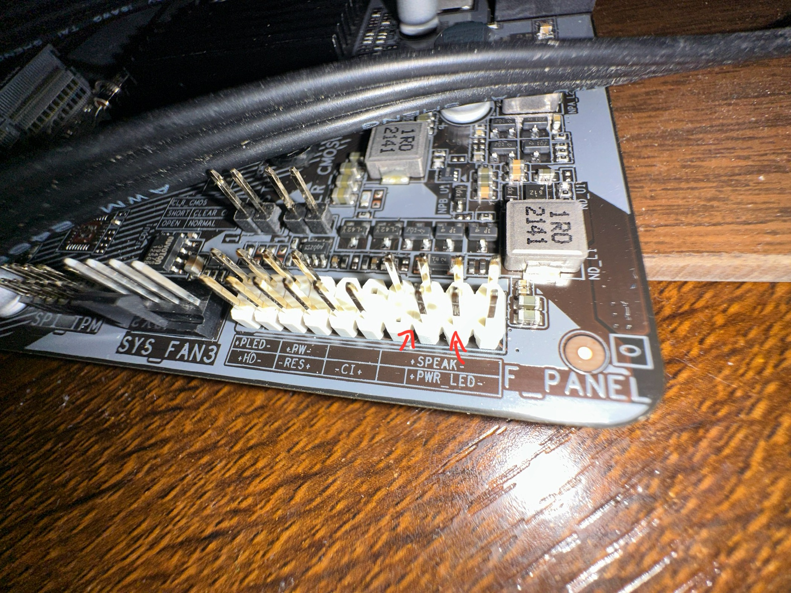
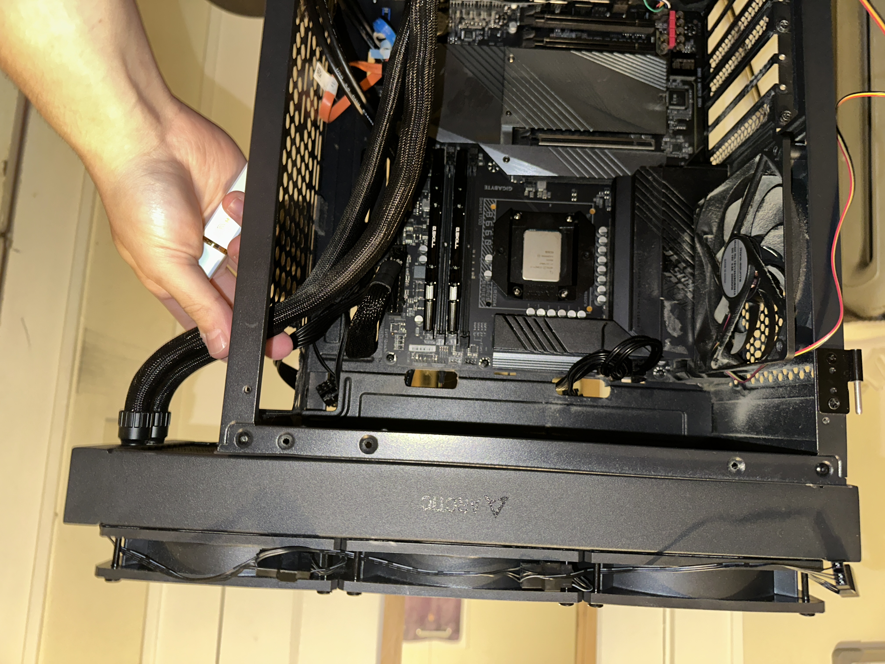

# 🧰 Hardware Fun – Troubleshooting Archive

This folder contains hardware photos, BIOS captures, and hands-on diagnostics from all machines in my local AI lab. It complements the architecture-level documentation with raw, system-level imagery — from GPU installations to SSD wiring and Wi-Fi module replacement.

---

## 🖥️ System Architecture

| Node            | CPU                         | GPU                                | RAM / Drives                                                    | OS             | Role                                    |
| --------------- | --------------------------- | ---------------------------------- | --------------------------------------------------------------- | -------------- | --------------------------------------- |
| **Main PC**     | i7-14700KF (20-core hybrid) | RTX 3070 (OC +180 Core / +675 Mem) | 64GB DDR4 @ 3600MTSamsung 870 EVO 500GBSeagate 3.7TBWD Blue 1TB | Windows 11 Pro | Core Orchestrator + High-VRAM LLM       |
| **Laptop**      | i7 12th Gen                 | RTX 3070 Ti (Laptop)               | 16 GB DDR5 @ 4800 MT                                            | Pop!\_OS       | Ollama + Secondary LLM Inference        |
| **Legacy Node** | i5-12400F                   | GTX 780 (3GB)                      | 32GB DDRR4 @ 3200 MT                                            | Windows 10     | File Watcher, Tokenizer, CLI Benchmarks |

---

## 📸 Embedded Screenshots

### 🔧 No Power Button, No Problem :)

### 🔥 Please don't judge my AIO placement(& the dust), my current case does not allow it within, so I had to improvise, and saw drastic temp drops

## 📁 Folder Purpose

* Used to visually document physical upgrades, port layouts, and diagnostic clues.
* All images are original captures (phone camera or screenshots) during real troubleshooting or setup work.
* This archive complements `/docs/`, `/Models/`, and `/scripts/` by grounding abstract configs in real hardware.

---

> *Part of the **********[AI Memory Architecture](https://github.com/Mugiwara555343/ai-memory-architecture)********** repository — documenting the full-stack evolution of a persistent local AI system.*
