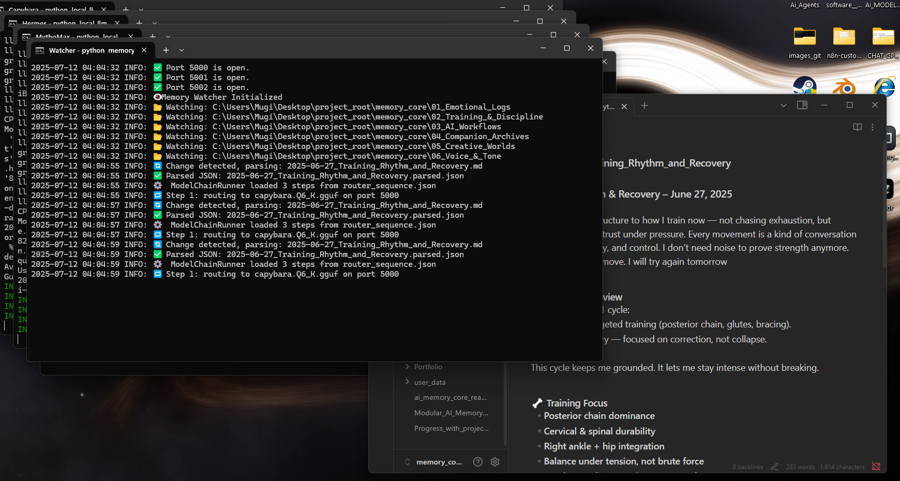
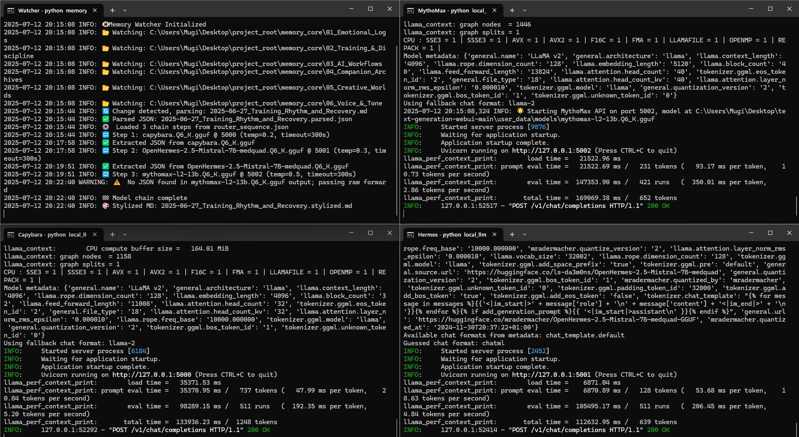

# AMA `-` AI Memory Architecture🧠

> A modular AI system that reflects, summarizes, and stylizes your memory — using local language models chained together in a persistent, privacy-first pipeline.


👉 [Try my custom GPT assistant](https://chatgpt.com/g/g-686d56d1a8048191bd32fdb5704d2eb4-memoryarchitect-gpt?model=o4-mini)
It helps coordinate the models and memory flow behind this repo.

---

## 📚 Table of Contents

- [What It Does](#-what-it-does)
- [Visual Flow](#-visual-flow)
- [AI Memory Workflow Showcase](#-ai-memory-workflow-showcase)
- [Folder Overview](#-folder-overview)
- [How To Run](#-how-to-run)
- [Example Output](#-example-output)
- [Roadmap](#-roadmap)
- [Tech Stack](#-tech-stack)
- [Creator](#-creator)

---

## 🔍 What It Does

* Watches `.md` logs for changes and parses them into structured `.json`
* Routes parsed memory through a **multi-model LLM chain**:

  * 🤍 Capybara → tags & emotions
  * 🧠 Hermes → summary metadata
  * 🎭 MythoMax → Markdown stylization
* Optionally pipes output into TTS (e.g., ElevenLabs) or future dashboards

---

## 📊 Visual Flow

[.png)](./docs/memory_flow_diagram_dark(2).png)

*A visual of the full offline memory chain — from raw journal to reflective output*

---

## 🧠 AI Memory Workflow Showcase

This section visually documents the real-time behavior of the local AI memory system — from journal creation to model parsing and multi-step inference. Each screenshot shows a critical step in how memory is detected, routed, and transformed by local language models in a modular chain.

---

### 1. ✍️ Memory Entry Logged

  
A journal entry (`.md`) is created in `memory_core/02_Training_&_Discipline`. This triggers the `memory_watcher.py`, which detects file changes automatically.

---

### 2. 🔁 Watcher + Parser Activated

  
The file watcher logs activity: detecting the new `.md` file, parsing it, and routing it through the `router_sequence.json`. Parsed `.json` and `.parsed.md` files are generated and stored.

---

### 3. 🧠 Multi-Model Inference Begins

  
The pipeline routes the parsed memory through 3 local LLMs:
- **Capybara** extracts emotions + tags  
- **Hermes** generates semantic summaries  
- **MythoMax** stylizes and enhances the final `.md` narrative  

Each model runs in its own session with detailed log output.

---

### 4. 📄 Structured Output Produced

  
A `.parsed.json` is created with tags, tone, meaning, and quotes — plus a stylized Markdown file showing the enhanced narrative. This allows both human and machine-readable outputs to coexist.

---

### 5. ⚠️ Error Handling (Capybara Timeout)

  
If a model fails (e.g., no valid JSON from MythoMax), the system logs a warning and continues with a fallback. This ensures resilience and recovery without manual intervention.

---

> This memory pipeline is fully offline and modular — a living architecture that turns raw thought into structured cognition. Built entirely with local tools.

---

## 📂 Folder Overview

```
memory/                # Human logs + parsed memory snapshots
scripts/               # Core processors(parser.py and watcher.py) + routers
n8n-workflows/         # Workflow automation (optional)
docs/                  # Progress reports, brainstorming, anything really
```

---

## ⚙️ How To Run

```bash
git clone https://github.com/Mugiwara555343/ai-memory-architecture.git
WORKING ON IT
```

✅ Markdown gets parsed
🧠 Models run in sequence
📄 Output: `.parsed.json` + stylized `.md` in terminal

---

## 📆 Example Output

```json
{
  "title": "First Encounter with Memory Core",
  "summary": "Reflective log capturing emotional tension and resolve.",
  "tags": ["memory", "emotion", "introspection"],
  "emotions": {"calm": 0.6, "anxious": 0.4}
}
```

---


## 🧱 Roadmap

- [x] Real-time file watcher for memory logs
- [x] Multi-model routing via router_sequence.json
- [x] Parsed `.json` and `.parsed.md` output
- [ ] Visual dashboards for memory summaries
- [ ] Live voice interaction (ElevenLabs + Whisper)
- [ ] Emotion-state memory chaining


---

## 👷️‍♂️ Tech Stack

* Python 3.11
* LM Studio
* Ollama
* Git
* Text-Web-UI
* llama.cpp (`llama-cpp-python`)
* FastAPI + Gradio
* n8n (optional workflow glue)
* Watchdog (live file watching)
* ElevenLabs (optional TTS)

---

## Creator

Built by **Mauricio Ventura**
AI Systems Builder | Automation Architect


---
