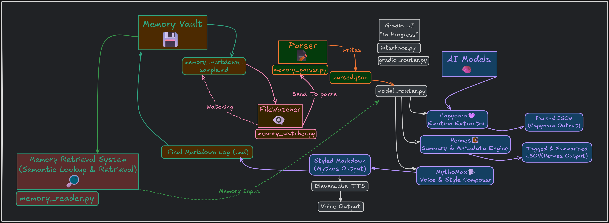

# AI Memory Architecture

> A modular AI system that reflects, summarizes, and stylizes your memory — using local language models chained together in a persistent, privacy-first pipeline.

Built as a **personal cognitive architecture**, this project processes Obsidian-style `.md` logs and transforms them into structured `.json` snapshots and stylized `.md` narratives. All locally, no cloud required.

👉 [Try my custom GPT assistant](https://chat.openai.com/g/g-XXXXX)
It helps coordinate the models and memory flow behind this repo.

---

## 🔍 What It Does

* Watches `.md` logs for changes and parses them into structured `.json`
* Routes parsed memory through a **multi-model LLM chain**:

  * 🐹 Capybara → tags & emotions
  * 🧠 Hermes → summary metadata
  * 🎭 MythoMax → Markdown stylization
* Optionally pipes output into TTS (e.g., ElevenLabs) or future dashboards

---

## 🧠 Visual Flow

[.png)](./memory_flow_diagram_dark(2).png)
[](./memory_flow_diagram_dark.png)
*A visual of the full offline memory chain — from raw journal to reflective output*

---

## 📂 Folder Overview

```
memory/                # Human logs + parsed memory snapshots
scripts/               # Core processors + routers
n8n-workflows/         # Workflow automation (optional)
models/                # GGUF local models (Capybara, Hermes, etc.)
```

---

## ⚙️ How to Run

```bash
git clone https://github.com/Mugiwara555343/ai-memory-architecture.git
cd ai-memory-architecture
pip install -r requirements.txt
python demo_run.py
```

✅ Markdown gets parsed
🧠 Models run in sequence
📄 Output: `.parsed.json` + stylized `.md` in terminal

---

## 📆 Example Output

```json
{
  "title": "First Encounter with Memory Core",
  "summary": "Reflective log capturing emotional tension and resolve.",
  "tags": ["memory", "emotion", "introspection"],
  "emotions": {"calm": 0.6, "anxious": 0.4}
}
```

---

## 🧱 Roadmap (Active)

*

---

## 👷️‍♂️ Tech Stack

* Python 3.11
* llama.cpp (`llama-cpp-python`)
* FastAPI + Gradio
* n8n (optional workflow glue)
* Watchdog (live file watching)
* ElevenLabs (optional TTS)

---

## 🙌 Creator

Built by **Mauricio Ventura**
AI Systems Builder | Automation Architect

> “Not just a note-taker — a local-first second brain.”

---
